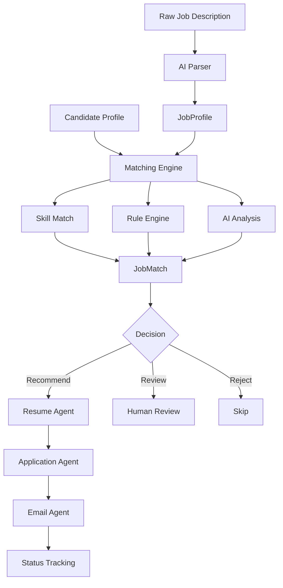

# Personal AI Job Agent - Project Specification

## 1. Product Vision & Purpose
A personal AI-powered job-hunting agent that manages the complete job-search lifecycle for a candidate. 
The system is built generically—capable of representing any candidate profile, though the initial target profile is a Data Engineer.

**Core Directives:**
* **AUTOMATE EVERYTHING THAT CAN SAFELY AND RELIABLY BE AUTOMATED.**
* **WHEN HUMAN ACTION OR CONFIRMATION IS REQUIRED, TELL THE USER EXACTLY WHAT TO DO.**
* **Never invent experience.** All AI claims must be strictly grounded in the candidate's actual data/resume.
* **No hardcoded personal names** in the codebase (namespaces, variables, databases, etc.).

## 2. Technology Stack
* **Backend:** .NET 10, ASP.NET Core Web API, C#
* **Database:** PostgreSQL with Entity Framework Core
* **Testing:** xUnit (Unit & Integration tests)
* **AI Integration:** Abstracted behind an interface (e.g., `IAiService`) to allow swapping providers (OpenAI, Azure OpenAI, local models).
* **Infrastructure:** Docker (for PostgreSQL & supporting services)
* **Frontend:** Future React Native mobile app (deferred until backend is mature)

## 3. High-Level Architecture

**Hybrid Matching Principle:**
* **LLM Responsibility:** Extract skills, understand unstructured JD text, distinguish mandatory/preferred requirements, analyze qualitative fit, and explain reasoning.
* **Deterministic Code Responsibility:** Salary math, experience gaps, location rules, hard blockers, final score calculation, and state management.

## 4. Domain Model (Core Entities)
* **Candidate:** `Id`, `Name`, `CurrentRole`, `Experience`, `Salary Preferences`, `NoticePeriod`
* **CandidateSkill:** `CandidateId`, `Name`, `YearsOfExperience`, `Proficiency`, `Evidence`
* **Job:** `Id`, `Company`, `Title`, `Description`, `Location`, `SalaryRange`, `Requirements`
* **JobMatch:** `Id`, `OverallScore`, `TechnicalScore`, `ExperienceScore`, `Recommendation`, `MissingSkills`
* **Application:** `Id`, `CandidateId`, `JobId`, `Status`, `AppliedAt`, `ResumeVersionId`
* **ApplicationEvent:** Lifecycle history (Discovered, Shortlisted, Applied, Assessment, Interview, Offer, Rejected, etc.)

## 5. Phased Implementation Roadmap

### Phase 1: Core Deterministic Engine (Current Phase)
- [x] **Step 1:** Canonical skills and aliases (Normalizing `Apache Airflow` -> `Airflow`, etc.).
- [x] **Step 2:** Comprehensive unit testing (Exact match, alias match, salary/location/experience rules, missing mandatory skills).

### Phase 2: Persistence & Data Layer (Next Up)
- [ ] **Step 3:** Add PostgreSQL via Docker configuration.
- [ ] **Step 4:** Add Entity Framework Core `DbContext` and migrations.
- [ ] **Step 5:** Persist entities (`Candidate`, `CandidateSkill`, `Job`, `JobMatch`).
- [ ] **Step 6:** Refactor API endpoints to load data from the database (e.g., change `POST /api/job-matching/evaluate` to `POST /api/jobs/{jobId}/analyze`).

### Phase 3: AI Abstraction & Job Parsing
- [ ] **Step 7:** Build AI JD Parser (Convert raw JD text -> structured `JobProfile` DTO).
- [ ] **Step 8:** Combine AI JD Parser with the Deterministic Matching Engine.

### Phase 4: Autonomous Agents
- [ ] **Step 9:** Job Discovery Agent (Scheduled ingestion from official APIs/feeds).
- [ ] **Step 10:** Resume Agent (Tailor master resume based on `JobMatch` and ATS keyword optimization without inventing facts).
- [ ] **Step 11:** Application Agent (Track applications and notify the user of required manual steps).
- [ ] **Step 12:** Email Agent (Scan inbox for recruiter updates, classify emails, map to `Application` status, log `ApplicationEvent`).

### Phase 5: User Interface & Analytics
- [ ] **Step 13:** React Native Mobile UI (Dashboards, pending actions, job swipe/review, notifications).
- [ ] **Step 14:** Interview Preparation Agent (Generate custom prep based on job requirements and candidate gaps).
- [ ] **Step 15:** Career Analytics.

### 6. Development Philosophy
1. Build incrementally. Do NOT build the entire autonomous agent at once.
2. Prioritize correctness, testability, and data integrity over pure automation.
3. Every important automated decision must be explainable.
4. AI must augment deterministic software, not replace core business logic.
5. **Security:** Sensitive configuration values (like API keys) MUST be provided via environment variables (e.g., `OpenAi__ApiKey`) in production/deployment environments. `appsettings.Development.json` is for local development only and should not be committed with actual secrets.

